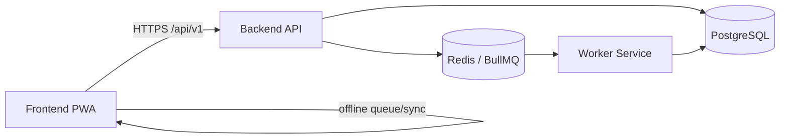

# Architecture Diagram

## Happy Path Sequence
1. User submits payment action in UI.
2. Backend validates auth + invariants.
3. Backend writes payment/transaction/ledger records.
4. Backend enqueues follow-up job.
5. Worker consumes and completes async side-effects.
