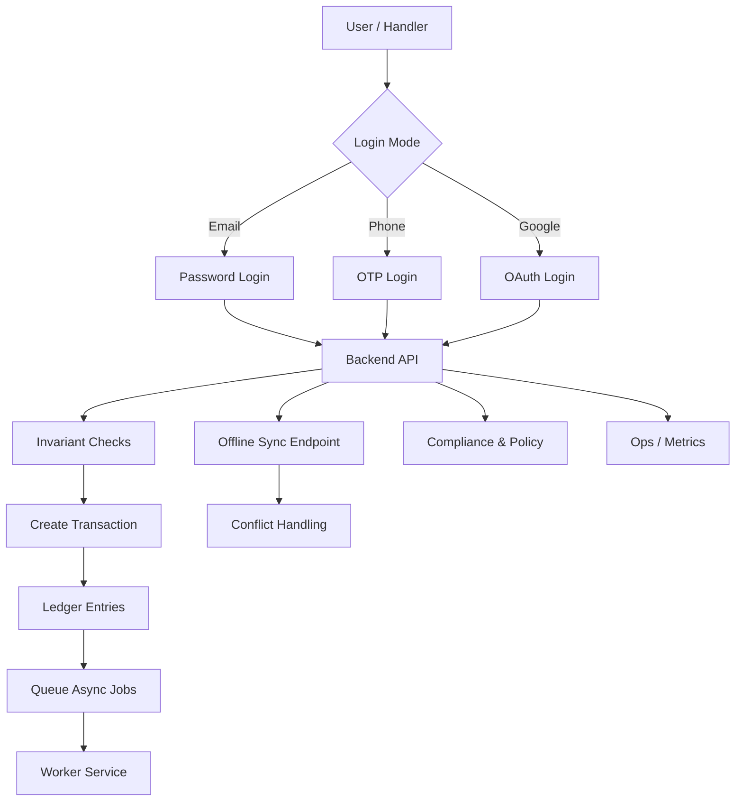
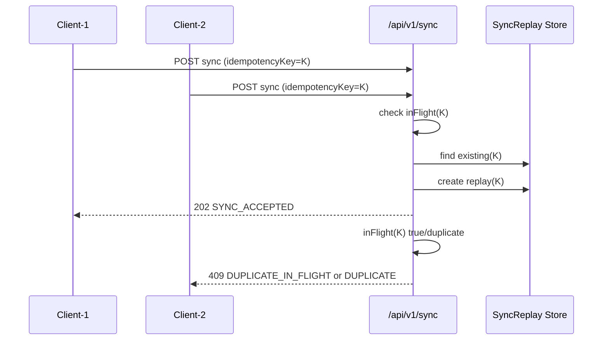
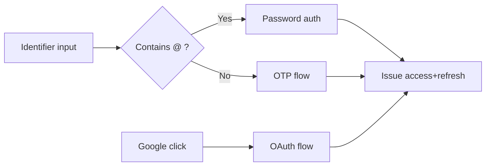
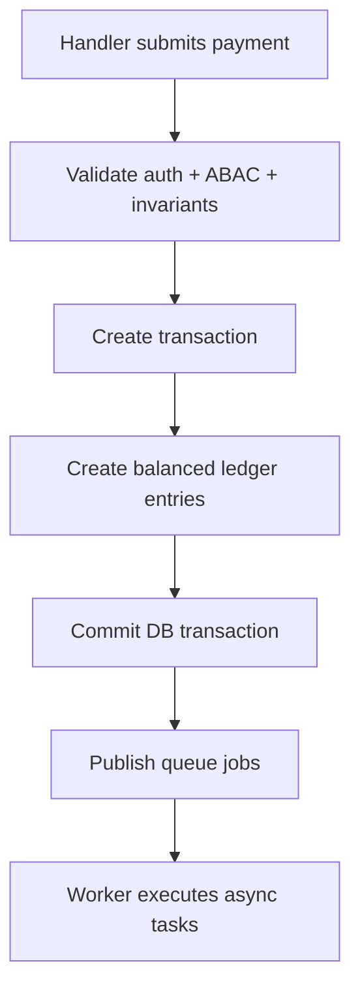

# GramFund Master Cases & Situations Playbook

> Comprehensive operating reference for real-world behavior, edge cases, failure modes, and handling strategy.

## Status Legend
- ✅ Implemented in current codebase
- 🟡 Partially implemented / requires follow-up
- 🧭 Planned (future)

---

## 1) End-to-End Product Visual

---

## 2) Case Coverage Matrix (All Major Situations)

| Domain | Case | Handling | Status |
|---|---|---|---|
| Concurrency | Same request repeated/replayed | Idempotency key + duplicate detection + in-flight lock | ✅ |
| Concurrency | Parallel same-key sync requests | one accepted, one rejected (409) | ✅ |
| Ledger correctness | Double-entry mismatch | invariant rejection | ✅ |
| Ledger correctness | Self-transfer | invariant rejection | ✅ |
| Ledger correctness | Negative/zero amount | invariant rejection | ✅ |
| Time & date | Backdated payment date | needs explicit `actualPaymentDate` field | 🟡 |
| Time & date | Multi-day events | schema extension `eventStartDate/endDate` | 🧭 |
| Identity | Dynamic email/phone login | single input decision path | ✅ |
| Identity | Google login | backend provider path available | 🟡 |
| Identity | Same user with multiple roles | supported by user-role model (with policy controls) | 🟡 |
| Family lifecycle | deactivate family without data loss | `isActive` pattern + no-delete policy | ✅ |
| Family lifecycle | split/merge family | needs dedicated models + transfer logic | 🧭 |
| Payment behavior | eventless support payment | nullable `eventId` | ✅ |
| Payment behavior | overpayment goodwill credit | documented, implementation pending | 🟡 |
| Notifications | retry on failure | status + retry count model | ✅ |
| Notifications | no-phone family fallback | manual confirmation flow to be surfaced in UI | 🟡 |
| Offline | duplicate entries | idempotency protection | ✅ |
| Offline | sync conflict | server-wins duplicate resolution | ✅ |
| Offline | device lost pre-sync | UX warning + auto-sync strategy pending | 🟡 |
| Compliance | KYC/Sanctions/Cases | compliance routes scaffolded | ✅ |
| Security | session/token rotation | signed token pair + refresh rotate | ✅ |
| Security | lockout/anomaly | risk service with failure lockout | ✅ |
| Observability | ops metrics endpoints | route-level scaffold exists | ✅ |
| Recovery | backup/restore drills | documented process; automation pending | 🟡 |
| Scale | 1000+ families search and pagination | partial scaffolding; indexing/pagination rollout pending | 🟡 |
| Legal trust | dispute and audit traceability | dispute module + audit middleware scaffold | ✅ |

---

## 3) Critical Flows (Visuals)

### 3.1 Concurrency-safe Sync Flow

### 3.2 Dynamic Auth Decision Flow

### 3.3 Payment + Ledger + Worker

---

## 4) Detailed Handling Notes by Requested Categories

### 4.1 Family Relationship / Social Cases
- Selective contribution is naturally supported (pairwise transaction edges), not universal participation.
- Social priority tagging should be persisted explicitly in family metadata for recommendation/analytics layers.

### 4.2 Contribution Behavior
- Overpayment should be modeled as intentional excess (goodwill) and carried as future event credit.
- Village/event-level partial payment policy should be config-driven (`allowPartialPayment`).

### 4.3 Family Lifecycle
- Deactivate, never hard-delete historical finance entities.
- Split/merge should be append-only operations with lineage references and optional settlement transfer records.

### 4.4 Event Complexity
- Dynamic participant membership and event cancellation should not mutate past ledger history.
- Multi-event parallelism supported through event-scoped transaction records.

### 4.5 Handler Risk / Human Mistakes
- Wrong entry must be corrected via adjustment transaction (never edit committed finance rows).
- Fraud suspicion requires anomaly flags + reconciliation + audit logs + admin alerting.

### 4.6 Payment & Proof
- Eventless aid payments are valid (`eventId = null`).
- Proof collection should support optional image + verification workflow.

### 4.7 Notifications
- Track delivery state + retry counts.
- Manual fallback path needed for families without reachable phone.

### 4.8 Offline Integrity
- Idempotency on every mutation request.
- Conflict resolution defaults to server-wins for duplicate records.
- UX should expose unsynced queue risk before app close/device loss.

### 4.9 Data Consistency
- Village uniqueness: normalized uniqueness constraints.
- Family display name collisions are acceptable if record identity remains ID-based.

### 4.10 Performance/Scale
- Pagination + indexed search + materialized family ledger views become required at scale.

### 4.11 Security / Legal
- Signed tokens + rotation + lockout already scaffolded.
- Policy docs + disputes + audit traces support legal explainability.

---

## 5) What Is Fully Handled vs Needs Next Sprint

### Fully handled baseline (production-direction)
- Idempotent request handling and replay protection
- Ledger invariants core checks
- Dynamic auth strategy baseline
- Compliance route scaffolding
- Offline queue/sync conflict path
- CI + migration validation workflow

### Needs implementation to call "fully production complete"
- Explicit schema fields for backdated `actualPaymentDate`, event date ranges
- Family split/merge tables + business services
- Overpayment credit accounting service
- Reminder subsystem (pending commitments, unrecorded collection nudges)
- Backup automation + restore drills in CI/ops pipeline
- Metrics dashboards + alerts

---

## 6) Final Readiness Scorecard

- Domain safety: **Strong baseline**
- Operational readiness: **Moderate (needs automation depth)**
- Compliance execution: **Scaffolded, not fully governed workflow**
- Scale readiness: **Roadmap identified; targeted engineering pending**

**Overall:** GramFund now covers most real-world scenarios with explicit handling strategy and clear next-step gaps.
